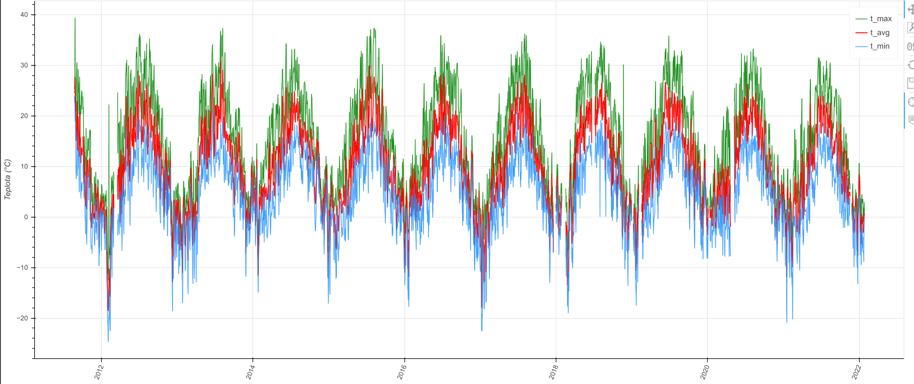
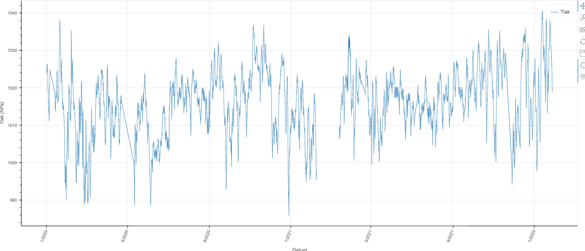
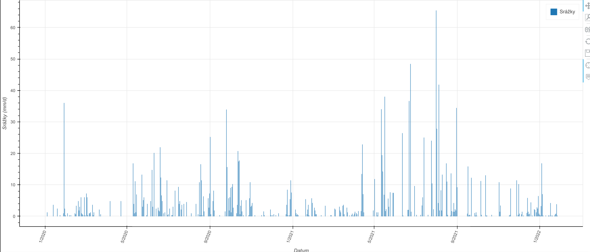
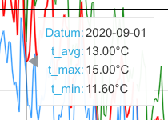

# Práce s grafy

Grafy jsou bezpochyby velmi pokročilou částí projektu. Grafy jsou poháněné přes knihovnu [bokeh](https://bokeh.org/) a
mají i vlastní třídu s několika metodami.

## Druhy dostupných grafů

Program má možnost vygenerovat tři typy grafů:

1. Denní souhrn maximální, minimální a průměrné teploty

   

   Tento spojnicový graf zeleně značí maximální denní teplotu, červeně průměrnou a modře minimální. Na hodnoty v legendě
   se dá klikat pro ztlumení dané spojnice.
2. Graf tlaku

   

   Graf tlaku je spojnicový graf, který zobrazuje všechny hodnoty tlaku v daném období.
3. Graf srážek

   

   Graf srážek je sloupcový graf zobrazující denní úrovně srážek.

## Sdílené vlastnosti mezi grafy

Každý graf zobrazuje na pozici myši křížek. Tento efekt se dá vypnout v boční liště nástrojů. Každý graf (mimo grafu
srážek) také obsahuje tooltip, který se zobrazí při přejíždění s myší.



## Tvorba grafů

Ke tvorbě grafů slouží třída {class}`pocasi.core.request.Graph`. Tato třída dědí ze třídy
{class}`pocasi.core.request.DataRequest` a její inicializace probíhá úplně stejně.

```pycon
>>> from pocasi.core.request import Graph
>>> graf = Graph("2020", "2021")
```

Každý graf popsaný v kapitole {ref}`requests/grafy:Druhy dostupných grafů` má svojí vlastní metodu. Po aktivaci metody
se poté dá přistoupit k veřejné proměnné `p` pro zpracování grafu dle vlastní libosti. Příklad zobrazení grafu denních
teplot:

```pycon
>>> from bokeh.io import show
>>> graf.daily_temp()
>>> show(graf.p)
```

:::{admonition} Metodu lze použit jen jednou za instanci objektu!
:class: danger

Za jednu instanci třídy {class}`pocasi.core.request.Graph` lze použit **jen jednu metodu** této třídy! Použití více
metod může vytvořit neočekávané výsledky!
:::

Proměnná `graf.p` je instancí Figure objektu z bokeh, který můžeme i vkládat do webových stránek, jak
ukazuje [bokeh dokumentace](https://docs.bokeh.org/en/latest/docs/user_guide/embed.html).

## Obsah třídy `Graph`

```{eval-rst}
..  autoclass:: pocasi.core.request.Graph
    :noindex:
    :members:
```